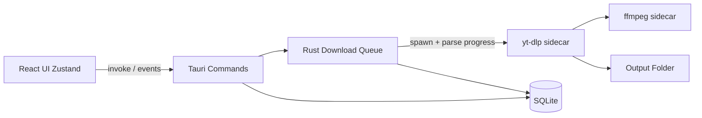

# Vidora — Tauri YouTube Downloader

## Product

**Vidora** is a local-first Windows desktop app (Tauri 2) for fetching YouTube media in any common format (MP3, MP4 360p/720p/1080p+, etc.). Engine: bundled **yt-dlp** + **ffmpeg** sidecars. UI: React + TypeScript + Tailwind + DaisyUI, with Framer Motion for 60fps GPU-friendly motion.

Respect YouTube ToS and copyright: the app is a personal media tool; users are responsible for what they download.

## Stack (locked)

| Layer   | Choice                                                      |
| ------- | ----------------------------------------------------------- |
| Shell   | Tauri 2                                                     |
| UI      | React 19 + Vite + TypeScript                                |
| Styling | Tailwind CSS 4 + DaisyUI 5                                  |
| Motion  | Framer Motion (`motion`)                                    |
| State   | Zustand                                                     |
| Routing | React Router                                                |
| Backend | Rust (queue, process mgmt, persistence)                     |
| Engine  | `yt-dlp` + `ffmpeg` as Tauri `externalBin` sidecars         |
| DB      | SQLite via `rusqlite` (history, favorites, settings, queue) |

Scaffold with `create-tauri-app` (React-TS), then layer Tailwind/DaisyUI, plugins, and Rust modules.

## Architecture



**Rust owns downloads** (not the frontend shell plugin alone): spawn sidecars from Rust, parse yt-dlp progress lines, emit typed events (`download:progress`, `download:done`, `download:error`) so the UI stays smooth and concurrent jobs stay controlled.

## App structure

```
vidora/
  src/                     # React
    components/            # glass panels, format picker, queue row, etc.
    pages/                 # Home, Queue, Library, Favorites, Settings
    store/                 # theme, queue mirror, settings
    hooks/                 # clipboard watch, media query
    motion/                # shared variants / transition tokens
    styles/                # semantic tokens, themes
  src-tauri/
    src/
      main.rs
      commands/            # fetch_info, enqueue, control, settings, yt_dlp_update
      queue/               # worker pool, pause/cancel
      ytdlp/               # args builder, progress parser
      db/                  # SQLite schema + repos
    binaries/              # yt-dlp-*, ffmpeg-* (setup script)
    capabilities/
  scripts/setup-sidecars.ps1
```

## Core flows

1. **Paste / clipboard URL** → `fetch_info` runs `yt-dlp -J` → show title, channel, thumb, duration, available formats.
2. **Pick format** (MP3 / MP4 quality / best) + options (subs, chapters, thumb embed, trim range) → enqueue.
3. **Queue worker** runs up to N concurrent jobs; progress streamed to UI; pause/resume/cancel via process control + restart with resume where yt-dlp supports it.
4. **Done** → write Library/History row; optional open folder / play externally.

## Features (all included)

**Download & formats**

- Video qualities via format selectors (`bv*+ba/b`, height filters for 360/720/1080/1440/2160)
- Audio-only MP3/M4A/Opus via ffmpeg postprocessor
- Playlist / channel batch: expand entries, enqueue with shared settings, per-item retry
- Concurrent downloads (configurable 1–4)
- Queue: pause / resume / cancel / reorder
- Speed limit (`--limit-rate`)
- Trim/clip (`--download-sections "*start-end"`) with start/end UI
- Subtitles (auto + manual), embed chapters, embed thumbnail
- Filename templates (`%(title)s [%(id)s].%(ext)s` + custom)
- Custom output directory (folder picker)
- yt-dlp self-update command from Settings

**Library UX**

- History with search/filter
- Favorites (star from result or history)
- Open containing folder / reveal file
- Clear history

**Clipboard**

- Background clipboard poll (Tauri clipboard plugin) when window focused/unfocused option; toast + “Use URL” when a YouTube link is detected

## UI / design system (Vidora)

**Art direction:** deep soft gradients (teal → ink, not purple-default), glass panels, ambient glow behind hero thumb, layered depth. Brand wordmark **Vidora** is hero-level on Home.

**Tokens:** CSS variables for semantic colors (`--surface`, `--surface-glass`, `--accent`, `--success`, `--danger`, `--text-primary/muted`), DaisyUI theme map for light + dark (`data-theme="vidora-light|vidora-dark"`).

**Typography:** distinctive pair (e.g. **Sora** UI + **Instrument Sans** or similar via Google Fonts) — clear scale: display / title / body / caption. Avoid Inter/Roboto/system defaults.

**Motion system (Framer Motion):**

- Shared `transition` tokens (spring soft, exit fade 150ms)
- Page enter: staggered opacity + y
- Queue rows: layout animations, progress bar width transform (GPU)
- Format chips / buttons: press scale, success check morph
- Theme toggle: crossfade surfaces
- Lazy-load route chunks + deferred thumbnail images

**Screens**

1. **Home** — brand, URL field, format strip, primary CTA, glass preview when metadata loads
2. **Queue** — interactive list, concurrency badge, controls
3. **Library** — history grid/list with lazy thumbs
4. **Favorites**
5. **Settings** — folder, concurrency, rate limit, template, theme, yt-dlp update, clipboard toggle

Keep first viewport cognitively light: brand + URL + one CTA group + preview; advanced options collapse into a sheet.

## Tauri plugins & capabilities

- `tauri-plugin-shell` — sidecar spawn permissions for yt-dlp/ffmpeg
- `tauri-plugin-dialog` — folder pick
- `tauri-plugin-clipboard-manager` — URL detect
- `tauri-plugin-notification` — download complete (optional toast OS-level)
- `tauri-plugin-fs` / opener — reveal files
- Capabilities JSON: restrict sidecar args to allowlisted patterns

## Sidecar setup

- `scripts/setup-sidecars.ps1` downloads Windows `yt-dlp` + `ffmpeg` into `src-tauri/binaries/` with target-triple suffixes
- `tauri.conf.json` → `bundle.externalBin`: `["binaries/yt-dlp", "binaries/ffmpeg"]`
- Document first-run: `npm run setup` then `npm run tauri dev`

## Implementation phases

1. Scaffold Tauri React-TS app named **Vidora**; Tailwind + DaisyUI themes; base shell/nav + light/dark
2. Sidecar script + Rust `fetch_info` / single download + progress events
3. Format picker UI + Home preview glass panel + motion system
4. Queue manager (concurrent, pause/cancel) + Queue page
5. Playlist expansion + batch enqueue
6. Advanced options: subs/chapters/thumb/trim/rate-limit/templates/output dir
7. SQLite history + favorites + Library/Favorites pages
8. Clipboard watcher + notifications + yt-dlp update in Settings
9. Polish pass: spacing, micro-interactions, empty states, error feedback, lazy routes

## Out of scope for v1

- Streaming in-app video player (reveal + OS default player instead)
- Non-YouTube sites (architecture can allow later via yt-dlp)
- Cloud sync / accounts

## Success criteria

- Paste a YouTube URL → pick MP3 or MP4 quality → file lands in chosen folder with live progress
- Playlist enqueues multiple jobs; concurrency respected
- Pause/cancel works; history and favorites persist across restarts
- Theme toggle is instant and consistent; animations stay smooth without jank
- `npm run setup` + `npm run tauri dev` runs on this Windows machine after Rust/Node prerequisites
